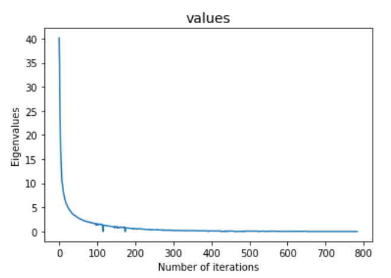
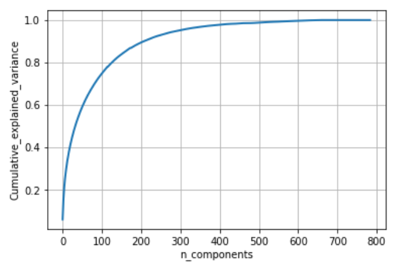
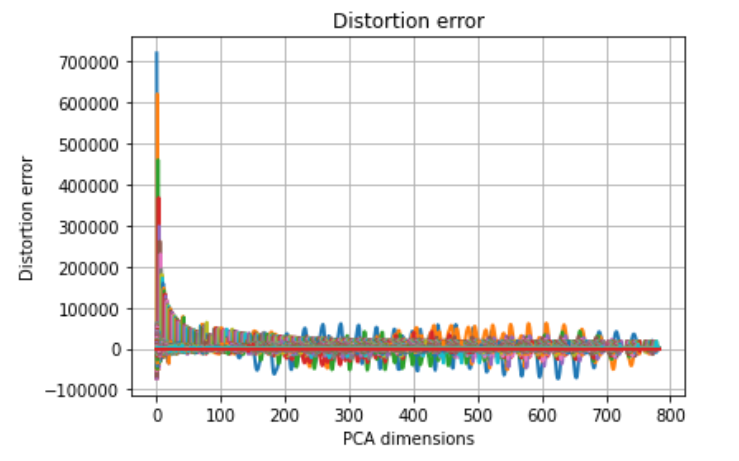
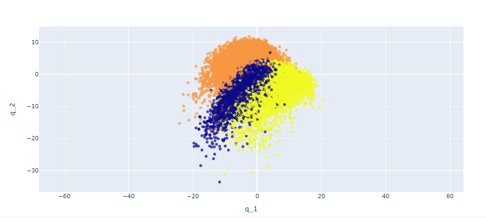
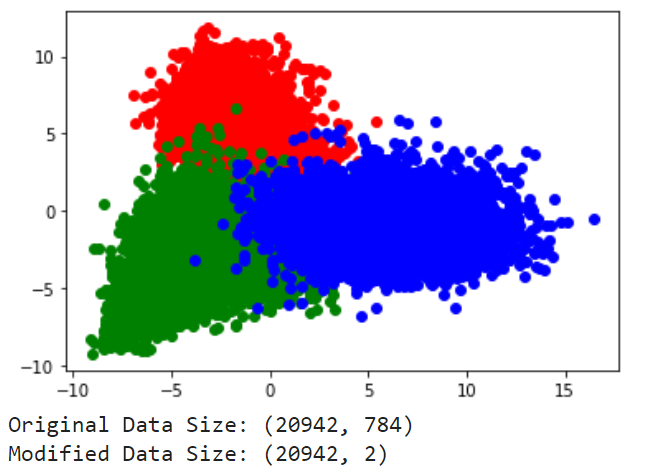

# PCA_LDA_from_scratch

## Problem statement

**Principal Component Analysis:**

Use all training images of three digits (‘4’, ‘7’ and ‘8’) in MNIST to estimate the principal component analysis (PCA) projection matrices, and then plot the total distortion error of these images as a function of the used PCA dimensions (such as 2, 10, 50, 100, 200, 300). Also, mention at least how many dimensions will you have to use in PCA in order to keep 98% of the total variance in data?

**Linear Discriminant Analysis:**

Use all training images of three digits (‘4’, ‘7’ and ‘8’) to estimate linear discriminant analysis (LDA) projection matrices for all possible LDA dimensions. What are the maximum LDA dimensions you can use in this case?

## Solution

**Principal Component Analysis:**

As per the 'Cumulative_explained_variance' graph shown above, we see that we need to use about 300 dimensions in PCA in order to keep 98% of the total variance in data.

**Linear Discriminant Analysis:**

In LDA, we can only use a maximum of 3 dimensions since we have only 3 class labels. Hence, using LDA, we would be able to separate the three classes in a maximum of 3 dimensions.

Comparing the two data visualization methods, we see that the PCA method has a more spread out and overlapping visualization for the data point. This is because the PCA algorithm does not classify the data well based on their class labels. On the other hand, LDA is able to classify the data in a better way. We see that in LDA, we have more compact grouping of classes in the graph.
